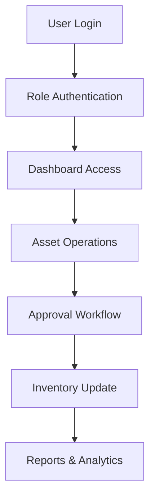
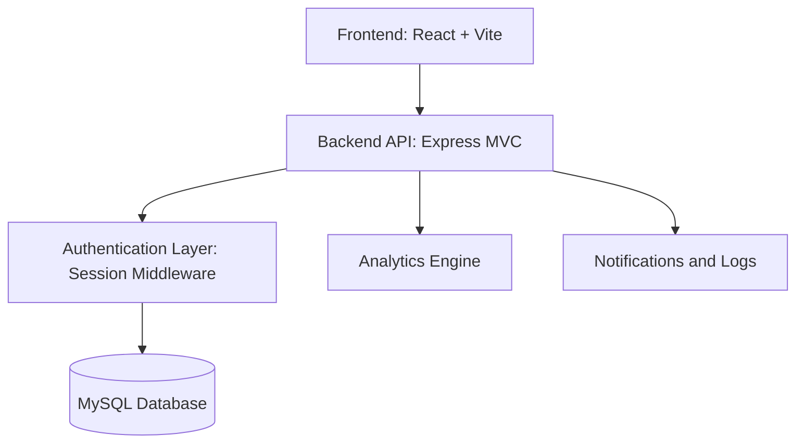
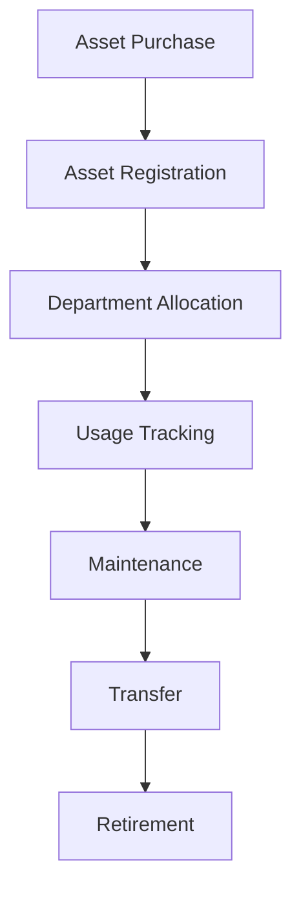

# AssetFlow: Enterprise Asset & Resource Management System

AssetFlow is a web application for managing enterprise assets, allocations, maintenance, bookings, audits, and notifications from a single interface.
It combines a React frontend with an Express and MySQL backend, with role-based access control for administrators, managers, and employees.

---

## Problem Statement

Organizations often track assets, requests, maintenance work, and audit activity across spreadsheets, chat threads, and disconnected tools. That approach makes it difficult to know what is assigned, what is available, and what needs attention.

AssetFlow addresses that gap by centralizing the full asset lifecycle in one application. It reduces manual coordination, improves traceability, and gives teams a shared view of inventory, approvals, and operational status.

## Solution Overview

AssetFlow is an internal asset and resource management platform built for day-to-day operational use.

It is used by administrators, asset managers, department heads, and employees to register assets, allocate or transfer equipment, raise maintenance requests, manage bookings, and review reports. The platform is organized into modules for authentication, organization setup, asset operations, workflow approvals, analytics, and notifications.

## Key Features

### Asset Lifecycle Management
Track assets from registration through allocation, return, maintenance, transfer, and retirement.
Each asset keeps its identifier, condition, location, and status in one place.

### Role-Based Access Control
Control access by role so each user sees only the actions and data relevant to them.
The current implementation supports admin, asset manager, department head, and employee workflows.

### Allocation and Transfer Workflows
Assign assets to employees or departments and route reassignment through the approval flow.
The system records allocation history so ownership changes remain traceable.

### Maintenance Tracking
Log maintenance requests, approval actions, technician assignment, and resolution notes.
This keeps service work visible and tied to the asset record.

### Audit and Compliance History
Run audit cycles, verify assets, capture exceptions, and close completed cycles.
The audit trail helps with accountability and internal compliance.

### Bookings, Notifications, and Reports
Reserve shared resources, receive platform notifications, and review summary metrics from the analytics views.
These modules help teams understand usage and follow up on pending work.

## System Workflow



1. User Login: The user signs in with an email and password.
2. Role Authentication: The backend validates the session and loads the user role.
3. Dashboard Access: The application renders the appropriate dashboard and modules.
4. Asset Operations: Users create, allocate, return, transfer, or review assets.
5. Approval Workflow: Role-gated actions are approved by the correct authority.
6. Inventory Update: The database is updated with the latest asset state.
7. Reports & Analytics: The UI shows summary counts, trends, and operational status.

## Architecture Overview



Frontend: Renders the login screen, dashboard, and module views. It handles local state, form input, and API calls.

Backend API: Exposes REST endpoints for auth, assets, organization setup, transfers, bookings, maintenance, audits, analytics, and notifications.

Authentication Layer: Validates the bearer session token, loads the current user, and enforces role-based authorization on protected routes.

Database: Stores users, departments, categories, assets, allocations, transfers, bookings, maintenance requests, audits, notifications, and activity logs.

Analytics Engine: Aggregates operational data for dashboard cards, summary counts, and reporting views.

Notifications: Records alerts and log entries so users can review actions, approvals, and status changes.

## User Roles

| Role | Responsibilities |
| --- | --- |
| Admin | Manage users, departments, categories, audits, and system-wide configuration. |
| Asset Manager | Register assets, approve allocations, handle transfers, and coordinate maintenance work. |
| Department Head | Request resources, oversee department-level assets, and participate in approvals. |
| Finance | Review usage and cost reports for budgeting and planning. |
| Employee | View assigned assets, submit requests, and track notifications. |

## Technology Stack

| Layer | Stack |
| --- | --- |
| Frontend | React 19, Vite, Tailwind CSS v4 |
| Backend | Node.js, Express, MVC structure |
| Database | MySQL with connection pooling |
| Authentication | Session tokens stored in the database, password hashing, role middleware |
| Deployment | Vite dev server for the frontend and Node.js for the API |
| Other Libraries | mysql2, dotenv, cors |

## Folder Structure

```text
AssetFlow-Enterprise-Asset-Resource-Management-System/
├── README.md
├── AssestFlow-frontend/
│   ├── package.json
│   ├── vite.config.js
│   └── src/
│       ├── App.jsx
│       ├── main.jsx
│       ├── index.css
│       ├── assets/
│       │   └── hero.png
│       ├── controllers/
│       │   └── useAppController.js
│       ├── models/
│       │   ├── api.js
│       │   └── services.js
│       └── views/
│           ├── AppLayout.jsx
│           ├── components/
│           │   ├── Header.jsx
│           │   ├── KPICards.jsx
│           │   ├── Modals.jsx
│           │   ├── Sidebar.jsx
│           │   └── ToastList.jsx
│           └── screens/
│               ├── AllocationsScreen.jsx
│               ├── AssetsScreen.jsx
│               ├── AuditsScreen.jsx
│               ├── BookingsScreen.jsx
│               ├── DashboardScreen.jsx
│               ├── LoginScreen.jsx
│               ├── MaintenanceScreen.jsx
│               ├── NotificationsScreen.jsx
│               ├── OrgScreen.jsx
│               └── ReportsScreen.jsx
└── AssetFlow-backend/
    ├── package.json
    └── src/
        ├── server.js
        ├── config/
        │   └── db.js
        ├── controllers/
        │   ├── analyticsController.js
        │   ├── assetController.js
        │   ├── auditController.js
        │   ├── authController.js
        │   ├── bookingController.js
        │   ├── maintenanceController.js
        │   ├── notificationController.js
        │   ├── orgController.js
        │   └── transferController.js
        ├── middlewares/
        │   └── authMiddleware.js
        ├── models/
        │   ├── Allocation.js
        │   ├── Asset.js
        │   ├── Audit.js
        │   ├── Booking.js
        │   ├── Category.js
        │   ├── Department.js
        │   ├── Log.js
        │   ├── Maintenance.js
        │   ├── Notification.js
        │   ├── Transfer.js
        │   └── User.js
        └── routes/
            ├── analyticsRoutes.js
            ├── assetRoutes.js
            ├── auditRoutes.js
            ├── authRoutes.js
            ├── bookingRoutes.js
            ├── maintenanceRoutes.js
            ├── notificationRoutes.js
            ├── orgRoutes.js
            └── transferRoutes.js
```

Important folders:

- `AssestFlow-frontend/src/controllers`: application state and screen orchestration.
- `AssestFlow-frontend/src/models`: API client helpers and service wrappers.
- `AssestFlow-frontend/src/views`: layouts, shared UI components, and screen-level pages.
- `AssetFlow-backend/src/config`: database initialization and seed data.
- `AssetFlow-backend/src/controllers`: request handlers for each business area.
- `AssetFlow-backend/src/models`: SQL-backed data access logic.
- `AssetFlow-backend/src/middlewares`: authentication and role protection.

## Screenshots

### Brand Preview


The repository currently includes this branding asset. Add full application captures under the sections below when you have them from a running build.

### Login

Add a screenshot of the sign-in page here.

### Dashboard

Add a screenshot of the dashboard here.

### Asset Management

Add a screenshot of the asset list or asset detail view here.

### Reports

Add a screenshot of the reporting or analytics view here.

### Users

Add a screenshot of the user and role management view here.

### Analytics

Add a screenshot of the analytics section here.

## Installation

### Prerequisites

- Node.js 20 or later
- MySQL Server running locally or remotely

### Backend Setup

```bash
cd AssetFlow-backend
npm install
npm run dev
```

Create a `.env` file in `AssetFlow-backend` before starting the server.
The backend bootstraps the database and tables on first launch.

### Frontend Setup

```bash
cd ../AssestFlow-frontend
npm install
npm run dev
```

Open `http://localhost:5173` in your browser.

## Environment Variables

### Backend

| Variable | Description |
| --- | --- |
| `PORT` | API server port. Defaults to `3000`. |
| `DB_HOST` | MySQL host name. |
| `DB_PORT` | MySQL port. Defaults to `3306`. |
| `DB_USER` | MySQL user name. |
| `DB_PASSWORD` | MySQL password. |
| `DB_NAME` | Database name created and used by the backend. |
| `JWT_SECRET` | Present in the example env file for future auth hardening. The current implementation uses session tokens. |

### Frontend

| Variable | Description |
| --- | --- |
| `VITE_API_BASE` | API base path for the frontend client. Defaults to `/api`. |
| `VITE_API_TARGET` | Vite dev proxy target for local backend development. Defaults to `http://localhost:3000`. |

## API Overview

### Authentication

Handles sign up, sign in, session restore, and logout.

### Assets

Covers asset listing, registration, allocation, return, history, and status changes.

### Users

Provides employee listing and role or status updates for administrators.

### Departments

Manages department creation, updates, and hierarchy data.

### Reports

Returns summary data for operational views and reporting screens.

### Maintenance

Tracks requests, approvals, technician assignment, and resolution.

### Analytics

Serves dashboard metrics and aggregate operational insights.

## Business Workflow



1. Asset Purchase: A new asset enters the organization.
2. Asset Registration: The asset is added to the inventory with its metadata.
3. Department Allocation: The asset is assigned to an employee or department.
4. Usage Tracking: The platform records where the asset is and who is using it.
5. Maintenance: Service requests are logged and resolved.
6. Transfer: Ownership or assignment changes are recorded through the workflow.
7. Retirement: End-of-life assets are removed from active circulation.

## Security Features

- Session token authentication
- Password hashing
- Role-based authorization
- Input validation on request payloads
- Protected API routes
- Bearer token checks in middleware

## Performance Considerations

- UI state is centralized in the application controller to avoid duplicated fetch logic.
- Backend queries are isolated in model classes, which keeps data access easier to optimize.
- The API and screen structure can support pagination for larger datasets without changing the overall flow.
- The frontend can be split into smaller bundles later through lazy loading if the app grows.
- Cached dashboard responses or client-side memoization can be added where repeated reads become expensive.

## Future Enhancements

- QR and barcode asset tracking
- RFID integration for inventory checks
- Mobile application
- AI-assisted maintenance prediction
- Email and SMS notifications
- Procurement automation

## Team

| Contributor | Focus |
| --- | --- |
| Add your name | Frontend UI, layout, and screen interactions |
| Add your name | Backend API, database schema, and auth flow |
| Add your name | Testing, documentation, and demo preparation |

## License

MIT